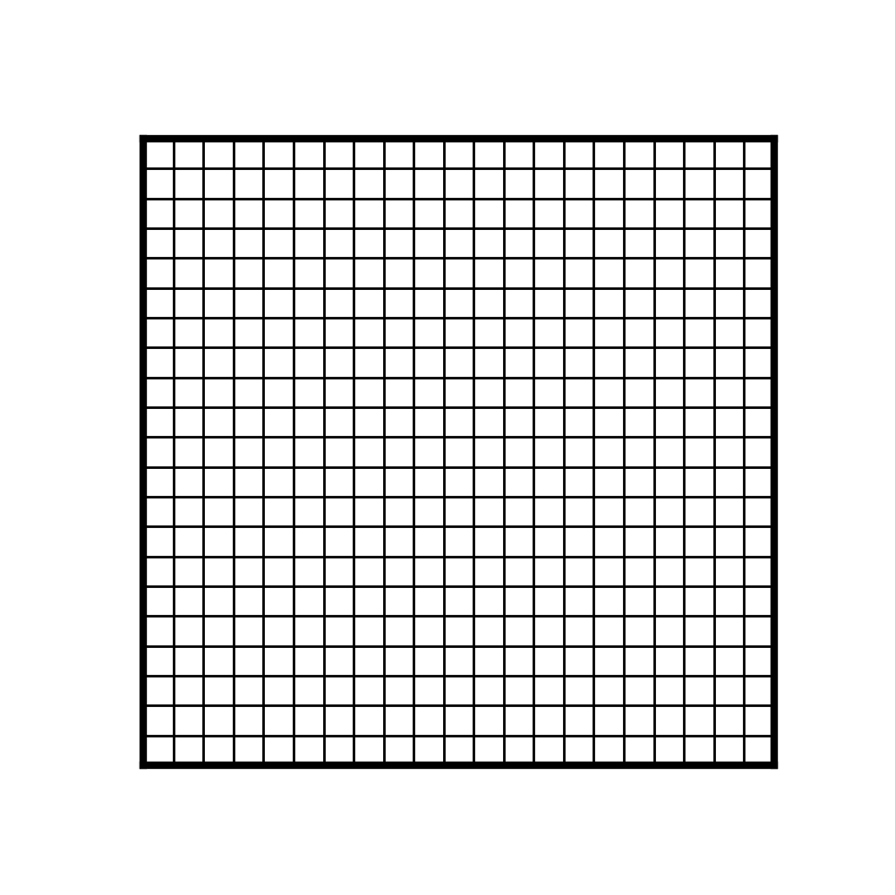
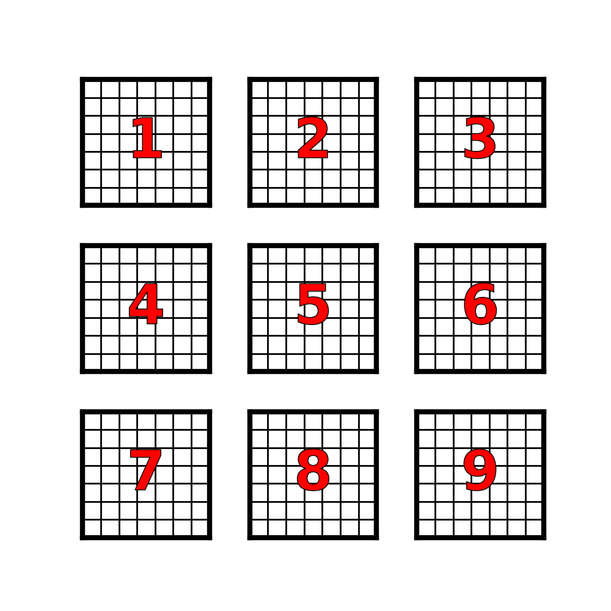

Need the following frames for synchronous stepping:

1. Level 1 all green
2. Level 1, element 9 red, rest green
3. Level 1, all red

Need the following frames for asynchronous stepping:

1. Level 1 all green
2. Level 1, element 9 red, rest green
3. Element 9 red level 1 (till the end), rest green level 2
4. Elements 6,8 red level 2 (till the end), rest green level 2
5. Rest green level 3
6. Elements 3,5,7 red level 3 (till the end), rest green level 3
7. Rest green level 4
8. Elements 2,4 red level 4 (till the end), rest green level 4
9. Rest green level 5
10. Element 1 red level 5 (end)

Need following frames for meshes:

1. Single large mesh 
2. Exploded 9 meshes no numbers
3. Exploded 9 meshes with numbers 